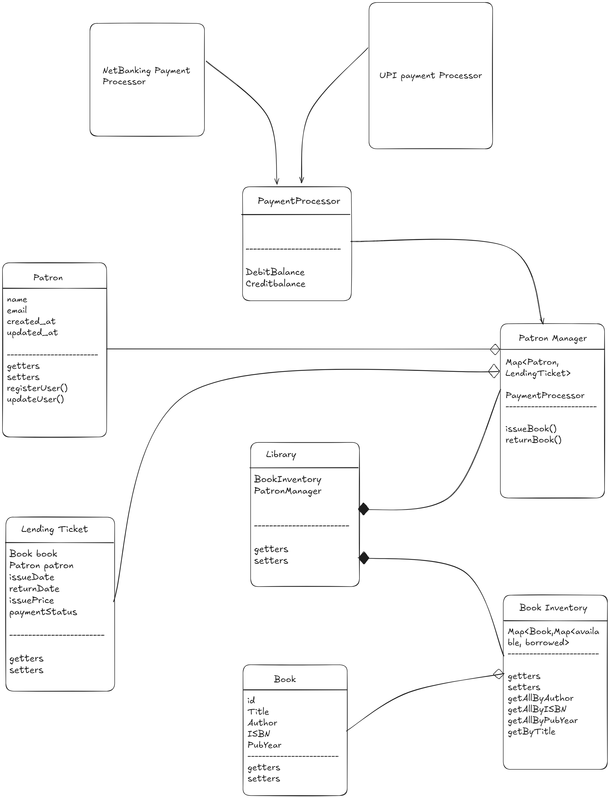

---

# Library Management System - Core Java CLI Application

This is a command-line interface (CLI) application for managing a library's inventory and patron activities. The system handles the process of adding books, registering patrons, and the core library functions of issuing and returning books.

Built entirely in Core Java, this project serves as a practical demonstration of Object-Oriented Programming (OOP) principles, clean code architecture, and common design patterns.

## Features

-   **Book Management**: Add new books with details like title, author, ISBN, and publication year to the library inventory.
-   **Patron Management**: Register new library patrons with a unique ID.
-   **Issue Books**: Issue available books to registered patrons. This flow includes a dummy payment processing step.
-   **Return Books**: Process the return of books from patrons and update the inventory.
-   **Search Functionality**: Search for books by title or look up books and patrons by their unique IDs.
-   **Reporting**: List all books in the library or view all books currently borrowed by a specific patron.

## Design Concepts Demonstrated

This project was designed with a focus on maintainability and scalability, showcasing several key software design concepts:

-   **SOLID Principles**:
    -   **Single Responsibility Principle**: Each class has a distinct responsibility (e.g., `BookInventory` only manages books, `PatronManager` handles patron logic, `LibraryCLI` handles user interaction).
-   **Facade Pattern**:
    -   The `Library.java` class acts as a simplified entry point to the system's more complex underlying components (`BookInventory`, `PatronManager`), providing a clean interface for the CLI.
-   **Strategy Pattern**:
    -   The payment system uses the `PaymentProcessor` interface to allow for interchangeable payment methods (e.g., `UPIPaymentProcessor`, `NetBankingPaymentProcessor`). This decouples the `PatronManager` from the specific payment implementation, making it easy to add new payment options in the future.
-   **Clear Separation of Concerns**: The project is organized into distinct packages for models (`entity`/`model`), business logic (`manager`/`core`), user interface (`cli`), and services (`payment`).



## Project Structure

The project follows a standard Java package structure to keep the code organized and maintainable.

```
src/main/java/com/yourname/librarysystem/
├── Main.java               // Main entry point of the application
├── cli/
│   └── LibraryCLI.java     // Handles all console input and output
├── core/
│   └── Library.java        // Facade class for the entire system
├── entity/ (or model)
│   ├── Book.java           // Represents a book
│   ├── Patron.java         // Represents a library member
│   ├── LendingTicket.java  // Represents a record of a book loan
│   └── PaymentStatus.java  // Enum for payment states
├── manager/
│   ├── BookInventory.java  // Manages the collection and stock of books
│   └── PatronManager.java  // Manages patron registration and lending logic
└── payment/
    ├── PaymentProcessor.java           // Interface for the Strategy Pattern
    ├── NetBankingPaymentProcessor.java // Concrete implementation for Net Banking
    └── UPIPaymentProcessor.java        // Concrete implementation for UPI
```

## How to Run the Project

#### Prerequisites

-   Java Development Kit (JDK) 8 or higher.

#### Steps

1.  **Clone the repository:**
    ```sh
    git clone <your-repository-url>
    cd <repository-name>
    ```

2.  **Compile the source files:**
    Navigate to the `src` directory and run the `javac` command. This command will compile all `.java` files and place the compiled `.class` files into a `bin` directory.

    ```sh
    # From the project's root directory
    mkdir bin
    javac -d bin $(find src -name "*.java")

    # for windows 
    javac -d bin -sourcepath src src\main\java\com\siddharth\librarysystem\Main.java
    ```
    *(Note: On Windows, you may need to use an alternative command to find all Java files)*

3.  **Run the application:**
    Execute the `main` method from the `bin` directory, making sure to provide the fully qualified class name.

    ```sh
    java -cp bin main.java.com.siddharth.librarysystem.Main
    ```

4.  **Use the application:**
    Once running, the application will display a menu of options. Simply enter the number corresponding to the action you wish to perform and follow the on-screen prompts.


